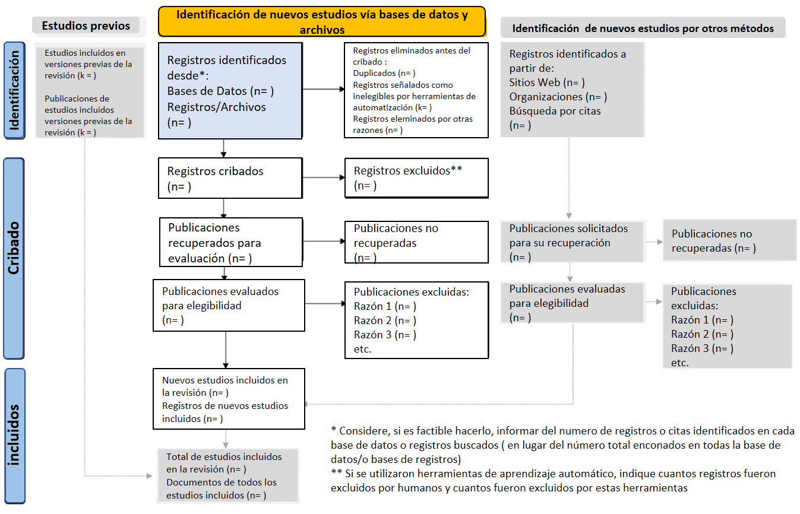
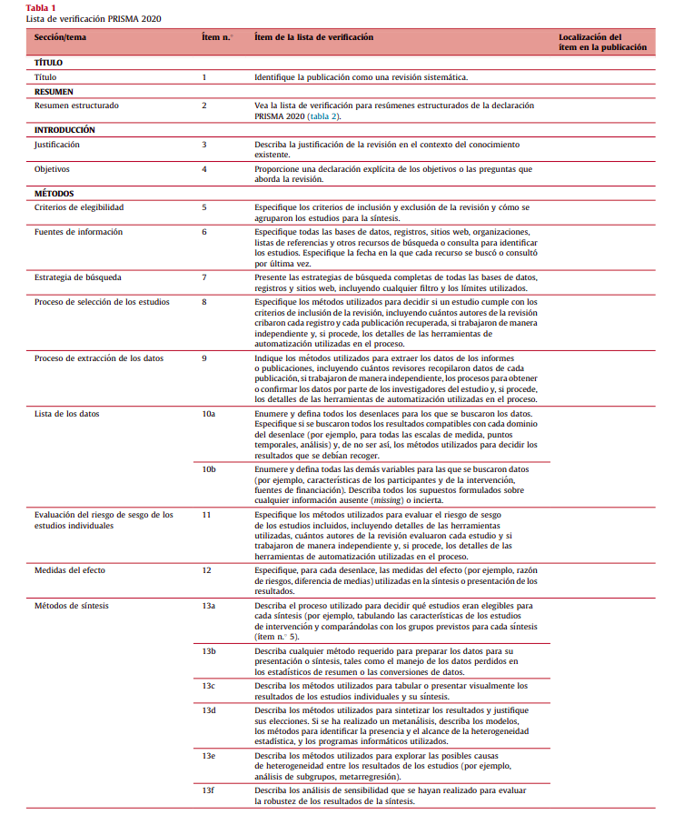
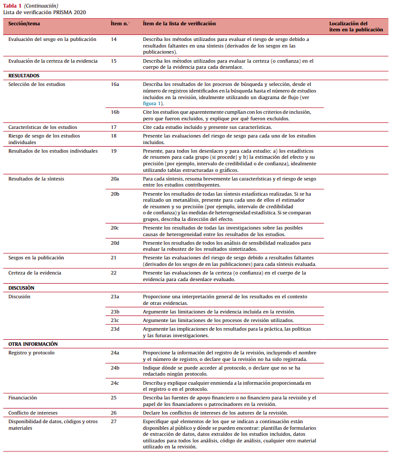
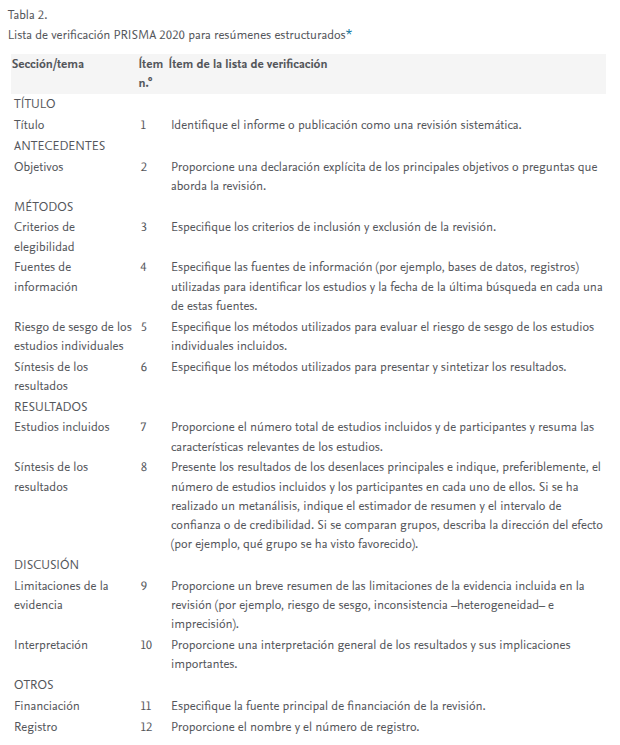

# Módulo 1: Modelo PRISMA △

## 1.1. Introducción
El modelo PRISMA (Preferred Reporting Items for Systematic Reviews and Meta-Analyses), publicada en 2009, se diseñó para ayudar a los autores de revisiones sistemáticas a documentar de manera transparente el porqué de la revisión, qué hicieron los autores y qué encontraron.

Su objetivo principal es mejorar la calidad de los informes en investigaciones basadas en evidencia.

La declaración PRISMA 2020 sustituye a la declaración 2009 e incluye una nueva guía de presentación de las publicaciones que refleja los avances en los métodos para identificar, seleccionar, evaluar y sintetizar estudios. Esta a sido diseñada principalmente para revisiones sintemáticas de estudios que evalúen los efectos de intervenciones sanitarias, independientemente del diseño de los estudios incluidos; sin embargo, los ítems de la lista de verificación son igualmente aplicables a las publicaciones de revisiones sistemáticas que evalúan otras intervenciones, no relacionadas con la salud (por ejemplo, intervenciones sociales o educativas).

El uso de este protocolo permite a los lectores evaluar la idoneidad de los métodos y, por lo tanto, la fiabilidad de los hallazgos. La presentación completa de todos los ítems de PRISMA también facilita la replicación y actualización de las revisiones, así como la inclusión de revisiones sistemáticas en revisiones panorámicas o revisiones de revisiones sitemáticas (overviews), para que los equipos puedan aprovechar el trabajo que ya esta hecho y evitar esfuerzos innecesarios de investigación.


---

## 1.2. Etapas del modelo PRISMA
El modelo PRISMA se representa mediante un diagrama de flujo dividido en cuatro fases:

1. **Identificación**:
   - Búsqueda de registros en bases de datos.
   - Registros identificados por otros medios.

2. **Cribado** (Screening):
   - Eliminación de duplicados.
   - Lectura de títulos y resúmenes.

3. **Elegibilidad**:
   - Revisión completa del texto.
   - Aplicación de criterios de inclusión/exclusión.

4. **Inclusión**:
   - Estudios que finalmente son incluidos en la revisión sistemática o metaanálisis.

## 1.2.1 Flujo de trabajo

<div style="text-align: center;">
    
</div>

La parte fundamental del diagrama son los 5 primeros cuadros desendentes que definen el proceso de revision, y las demas cajas, solo deben completarse si proceden, de lo contrario deben de ser eliminadas del diagrama de flujo.

---

## 1.3. Construcción del diagrama PRISMA
Puedes construir el diagrama de flujo PRISMA manualmente o usando herramientas como:
- Pagina Web con plantilla de flujo: https://estech.shinyapps.io/prisma_flowdiagram/
- Microsoft PowerPoint o Word (plantillas de flujo)
- Plantillas en LaTeX para artículos científicos

En el marco de una revisión sistemática conforme a los lineamientos del modelo PRISMA 2020, el primer paso fundamental consiste en la **búsqueda estructurada de literatura científica** en diversas bases de datos académicas. Esta búsqueda se lleva a cabo utilizando **fórmulas booleanas** compuestas por conectores lógicos como **AND, OR y NOT**, los cuales permiten afinar los resultados y garantizar la relevancia de los documentos recuperados. Esta estrategia de búsqueda debe ser adecuadamente documentada para asegurar la transparencia y replicabilidad del estudio.

La revisión inicia con una **introducción contextualizada**, en la cual se expone con claridad la motivación del estudio, justificando la importancia del tema seleccionado y su pertinencia en el marco científico actual. A continuación, en la sección de **métodos**, se detallan minuciosamente los procedimientos utilizados para llevar a cabo la búsqueda sistemática, incluyendo las bases de datos consultadas como; **Google Scholar, Scopus, PubMed, ScienceDirect, Redalyc**, entre otras, así como las fórmulas de búsqueda aplicadas en cada una de ellas.

Posteriormente, se aplican **criterios de inclusión y exclusión** justificados, con el objetivo de filtrar los estudios pertinentes y descartar aquellos que no se alinean con los objetivos de la revisión. Entre los criterios de exclusión pueden considerarse factores como la irrelevancia del título, duplicaciones entre bases de datos, o la ausencia de información metodológica sólida. El proceso de selección se representa gráficamente mediante el **diagrama de flujo PRISMA 2020**, el cual indica el número total de registros identificados, los excluidos en cada etapa, y el número final de estudios incluidos para análisis.

Una vez seleccionados los artículos, se procede al **análisis detallado del contenido**, donde se examinan las metodologías empleadas, los principales hallazgos, y las evidencias que respaldan cada estudio. Durante esta fase, se pueden identificar nuevas referencias de interés citadas en los artículos revisados, las cuales también pueden ser consideradas para su inclusión si aportan valor significativo a la investigación.

Es importante señalar que, aunque el proceso sigue una estructura sistemática, existe un grado de flexibilidad en la organización de los datos recolectados, especialmente en el diseño y llenado de las tablas de extracción de información. No obstante, se exige que toda la información incluida sea relevante, clara y sintetizada con rigor científico.

La sección de **discusión** representa el componente interpretativo del reporte. En esta se contrastan los resultados obtenidos, se analizan las diferencias entre estudios, y se explican posibles variaciones metodológicas o contextuales. Aquí se destacan los aportes relevantes de cada investigación, fundamentados en la evidencia recopilada.

Finalmente, las **conclusiones** deben ser precisas y reflejar el valor agregado de la revisión sistemática. En muchos casos, estas conclusiones pueden sugerir nuevas líneas de investigación o identificar vacíos en el conocimiento actual que requieran ser abordados en futuros estudios.

Ejemplo visual:
```
Identificación
└── 500 registros encontrados en bases de datos
    └── 100 registros adicionales de otras fuentes

Cribado
└── 480 registros tras eliminar duplicados
    └── 300 excluidos por título/resumen

Elegibilidad
└── 180 artículos leídos a texto completo
    └── 120 excluidos por criterios

Inclusión
└── 60 estudios incluidos en el análisis
```
## 1.3.1. Lista de verificación PRISMA 2020
La declaración PRISMA 2020 consta de una lista de verificación de 27 elementos que aborda las secciones de introducción, métodos, resultados y discusión de un informe de revisión sistemática, y una lista de verificación de 12 elementos para el resumen. Una vez que los usuarios registren una respuesta para cada elemento de la(s) lista(s) de verificación a continuación, podrán generar y descargar un informe de su lista completa en formato Word o PDF.

<div style="text-align: center;">
    
</div>
<div style="text-align: center;">
    
</div>

<div style="text-align: center;">
    
</div>

Al tambien ser usado en metaanalisis algunos items no seran incluidos por lo tanto no procederan o se pueden dejar en blanco.

---

## 1.4. Referencias
- Declaración PRISMA 2020: https://www.prisma-statement.org/prisma-2020
- Lista de verificación PRISMA 2020: https://prisma.shinyapps.io/checklist/
- Ejemplos de diagramas: https://www.prisma-statement.org/prisma-2020-flow-diagram
- Artículo original: Moher D, Liberati A, Tetzlaff J, Altman DG, The PRISMA Group (2009)
- El protocolo PRISMA para revisiones sistemáticas: https://www.youtube.com/watch?v=6PNyj_q_tbo
- Haz una buena REVISIÓN SISTEMÁTICA: PRISMA, paso a paso | Tutorial | Mr. Hipotálamo: https://www.youtube.com/watch?v=fHN3PyCh7HQ
- Declaración PRISMA 2020: una guía actualizada para la publicación de revisiones sistemáticas: https://www.revespcardiol.org/es-declaracion-prisma-2020-una-guia-articulo-S0300893221002748
- Declaración PRISMA 2020: una guía actualizada para la publicación de revisiones sistemáticasThe PRISMA 2020 statement: an updated guideline for reporting systematic reviews: https://www.sciencedirect.com/science/article/pii/S0300893221002748?via%3Dihub
- Create flow diagram: https://estech.shinyapps.io/prisma_flowdiagram/
- [POR LAS RAMAS] Flujograma con recomendaciones PRISMA. Rápido y explicado: https://www.youtube.com/watch?v=tKeUZ7hz7mQ
- 
---

_Continuar con el Módulo 2: Búsqueda avanzada de literatura académica._

